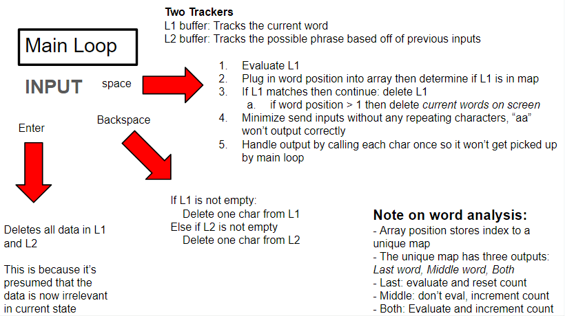

# Word Replacement
Substitute a phrase with another phrase (insert GIF example here)

This repository contains source code, binaries (Windows x86-64AMD), and python scripts to automate some of the csv work.
## Table of Contents
- [Getting Started](#getting-started)
- [Usage](#usage)
    - [Make Your Own List Of Words](#make-your-own-list-of-words)
- [How It Works](#how-it-works)
- [Bug Report](#bug-report)


## Getting Started
### Pre reqs
- (**required**) Windows (x64)
    - I'm using Windows for the keypresses
- (**optional**) A python3 interpreter


Either you [don't have a C++ Compiler](#you-don't-have-a-c++-compiler) or [you do have one](#you-have-a-c++-compiler)

### You don't have a C++ Compiler
You will need to 
1. download the executable 
``` ./WordReplacement/bins/Word-Replace.exe ```
2. Windows will warn you that it's dangerous (because I don't have any security in the software), just say "keep it"
3. Everytime you run the application it will ask if you're sure, just click "run anyways"

If you don't want to deal with this, then build it yourself.


### You have a C++ Compiler
If you have a C++ compiler then you all you'll need to compile is any variation of the ```WordReplace.cpp``` source code file. The DEBUG version will print out program states into the console, and self versions won't rely on an external csv file during runtime (since it matches the pairs of words at compile time). For example if you're in the parent directory and using g++ then run this command:
```
g++ ./WordReplacement/src/WordReplace.cpp -o "Word Replace"
```


## Usage
1. Run the program
    - You can add a shortcut you can click so you don't have to look it up
2. Type a word
3. Press the spacebar to evaluate the word according to the definitions in ```Constitution.txt```
4. If the word is set to change according to the settings then it will get modified
5. rctrl to exit the program and close the application window

### Make Your Own List Of Words
If you'd like to create your own constitution then there's a python script ```createCSV.py``` that will take two text files, one called ```word-to-replace.txt``` and ```words-to-add.txt``` and will do a one-to-one matchup between the two. 

```word-to-replace.txt``` should only have 1 word per line since the app currently only works on singular words.

```words-to-add.txt``` should only have 1 word or phrase per line to matchup with the same line in ```word-to-replace.txt```

You can also just delete or add to the csv file manually. 

If you're you're using ```Word-Replace-self``` (the one that doesn't pull from a csv everytime it runs) then you'll need to download the executable ```Word-Replace.exe```. Go back to [getting started](#getting-started) for directions.


## How It Works
The code is all in one source file because I don't intend on expanding the software, and compiling wouldn't change because of the dependency graph. So there's little incentive for me to spend time on that. 

The diagram below gives a brief overview of how the program functions


```words-to-add.txt``` and ```words-to-remove.txt``` are phrases generated from ChatGPT when asked to create a list of 100 "sad words" and "phrases in 5 words or less".


### source code difference
Every executable works the same, however ```Word-Replace-self``` implements the unordered_map inside the source code instead of pulling from a csv everytime to make it so you don't have to download the csv and put it in the same folder during setup. So modifying it from the source looks like the code block below. This is instead of just opening up the csv in a text editor or an excel sheet (prefered)

```
Word-Replace-self.cpp (Original)
    map = {{"test", "loop"}, {"wam", "bam"}};
Word-Replace-self.cpp (Adding a key/value pair)
    map = {{"test", "loop"}, {"wam", "bam"}, {"foo", "bar"}};
```


## Bug Report
Add me on discord or send email (links are in my profile)
